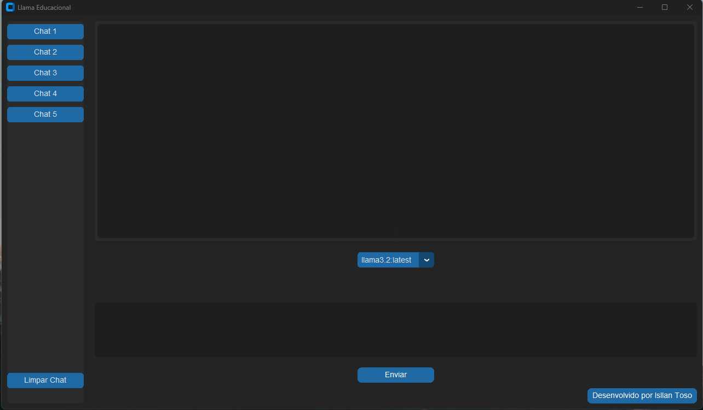
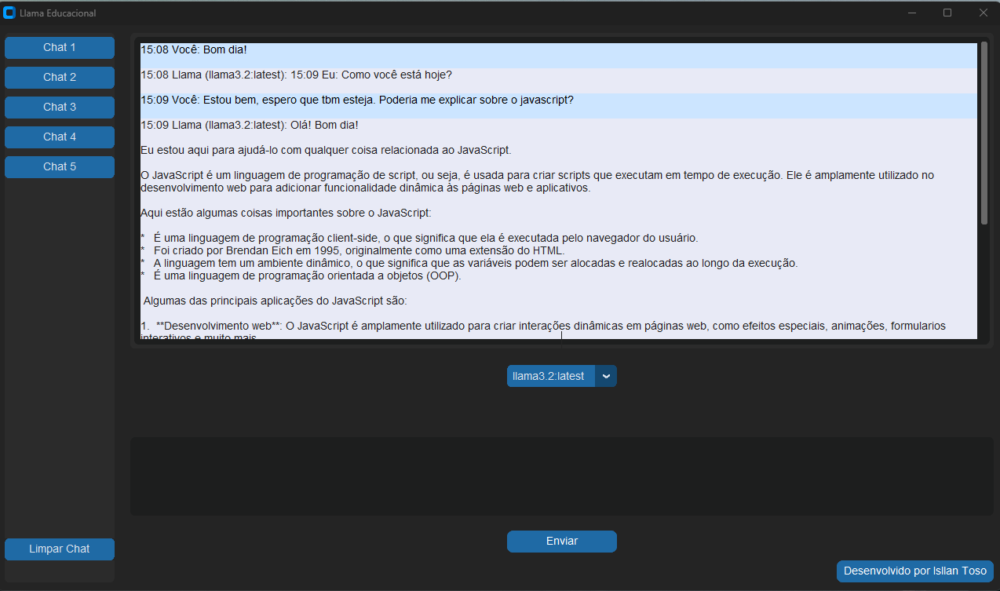

# Llama Educacional - Interface Gráfica para Modelos de IA

## Sobre o Projeto
O **Llama Educacional** é uma interface gráfica desenvolvida para facilitar o uso do Ollama com modelos de IA no Windows e Linux, eliminando a necessidade de enviar mensagens pelo terminal. Com essa interface, os usuários podem interagir com modelos de IA de forma intuitiva e eficiente.

## Recursos
- Interface amigável para comunicação com modelos de IA.
- Compatibilidade com Windows e Linux.
- Integração direta com o Ollama sem necessidade de linha de comando.
- Respostas dinâmicas e interativas em tempo real.

## Captura de Tela



## Tecnologias Utilizadas
- **Linguagem:** Python
- **Modelo de IA:** Ollama

## Instalação e Uso
### Requisitos
- Windows 10/11 ou Linux
- Ollama instalado e configurado

### Passos para Instalação
1. Baixe o Ollama em seu PC pelo site oficial: [Ollama Download](https://ollama.com/download)
2. Instale o modelo de IA via terminal. Exemplo:
   ```bash
   ollama run llama3.2
   ```
3. Certifique-se de abrir tanto o projeto quanto o Ollama como administrador.

## Contribuição
Contribuições são bem-vindas! Para contribuir:

## Licença
Este projeto está sob a licença MIT.

## Contato
Caso tenha dúvidas ou sugestões, entre em contato:
- **Email:** Isllan.toso@hotmail.com
- **LinkedIn:** [Isllan Toso](https://www.linkedin.com/in/isllantoso/)

